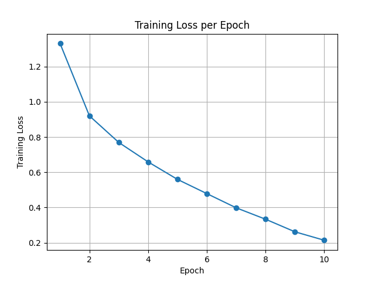
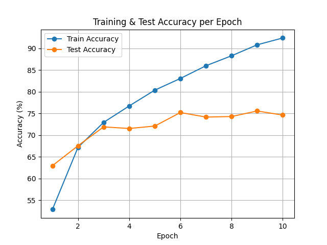
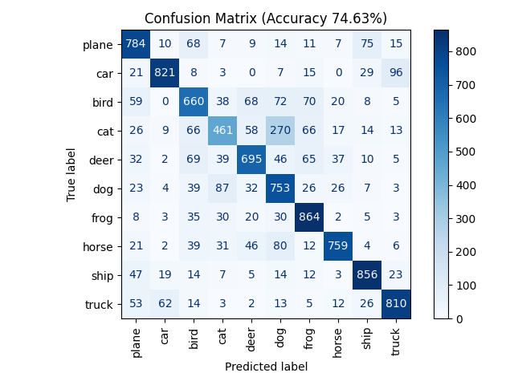
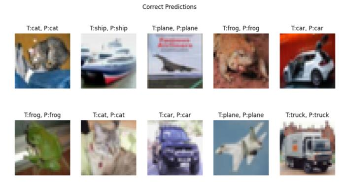
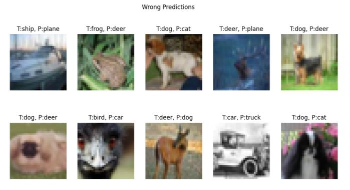

# CIFAR-10 Image Classification with a CNN (PyTorch)

A compact convolutional neural network for 10-class image classification on **CIFAR-10**, with a study of how hidden-layer size and learning rate affect accuracy, generalization and training time, and a comparison against classical baselines (**k-Nearest Neighbors** and **Nearest Class Centroid**).

> Project 1 of [Neural Networks & Deep Learning](../README.md), ECE AUTh (Fall 2025).

## Highlights

- **75.95% test accuracy** with a 2-block CNN trained for only 10 epochs, with no data augmentation
- Systematic sweep across **5 hidden-layer sizes × 2 learning rates**
- **~2× the accuracy** of the best classical baseline (kNN, 38.73%)

## Model

```
Input 3×32×32
 → Conv(3→32, 3×3) → BatchNorm → ReLU → MaxPool 2×2   # 32×16×16
 → Conv(32→64, 3×3) → BatchNorm → ReLU → MaxPool 2×2  # 64×8×8
 → Flatten → Linear(4096 → N) → ReLU → Linear(N → 10)
```

- **Loss:** Cross-Entropy · **Optimizer:** Adam · **Batch size:** 64 · **Epochs:** 10
- **Preprocessing:** tensor conversion + channel-wise normalization (mean = std = 0.5)
- **N** (hidden units) ∈ {128, 256, 384, 512, 1024}

## Results

### CNN: effect of hidden units and learning rate

| Hidden units | Test acc. (lr = 0.0005) | Train time (s) | Test acc. (lr = 0.001) | Train time (s) |
|---:|---:|---:|---:|---:|
| 128  | 73.59% | 226 | 74.42% | 215 |
| 256  | 73.84% | 250 | 74.23% | 251 |
| 384  | 73.96% | 264 | 73.44% | 262 |
| 512  | 74.77% | 265 | 74.63% | 327 |
| 1024 | **75.95%** | 325 | 74.91% | 326 |

Training accuracy reached ~87–95%, so the larger models overfit noticeably. Test accuracy still improves with capacity, and the lower learning rate gives the best result.

### Comparison with classical baselines

| Model | Test accuracy | Time (s) |
|---|---:|---:|
| **CNN (1024 units, lr = 0.0005)** | **75.95%** | 325 (training) |
| kNN, k = 1 (with PCA) | 38.73% | 0.40 |
| kNN, k = 3 (with PCA) | 36.72% | 0.39 |
| kNN, k = 1 (raw pixels) | 35.39% | 8.63 |
| kNN, k = 3 (raw pixels) | 33.03% | 7.33 |
| Nearest Centroid (raw pixels) | 27.74% | 1.24 |
| Nearest Centroid (with PCA) | 27.68% | 0.05 |

### Training curves (sample run)

<p align="center">
  
  
</p>

### Confusion matrix (sample run)

<p align="center"></p>

Vehicles (car, ship, truck) are classified most reliably. Most errors happen between visually similar animal classes, with **cat → dog** the most frequent confusion.

### Example predictions

**Correct**
<p align="center"></p>

**Wrong**
<p align="center"></p>

## How to run

```bash
pip install -r requirements.txt
python train.py                           # defaults: 1024 hidden units, lr 0.0005, 10 epochs
python train.py --neurons 512 --lr 0.001  # any other configuration
```

CIFAR-10 is downloaded automatically into `./data` on first run. The script saves outputs to `results/`:
- the confusion matrix
- loss and accuracy plots
- a per-epoch CSV log
- sample correct and wrong predictions

A GPU is used automatically if one is available.

## Repository structure

```
├── train.py          # model, training, evaluation, plots
├── requirements.txt
├── assets/           # figures used in this README
└── docs/report.pdf   # full project report
```

## Report

The full write-up (methodology, results, discussion) is in [`docs/report.pdf`](docs/report.pdf).
