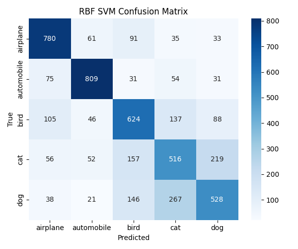
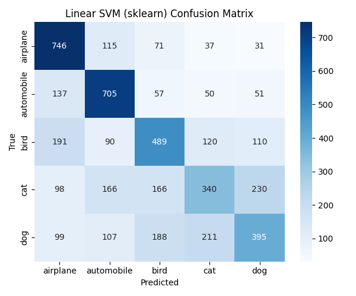
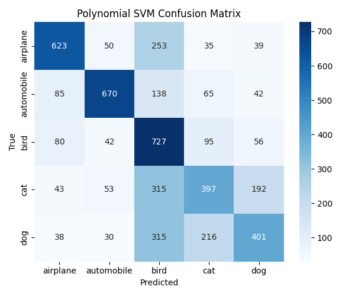
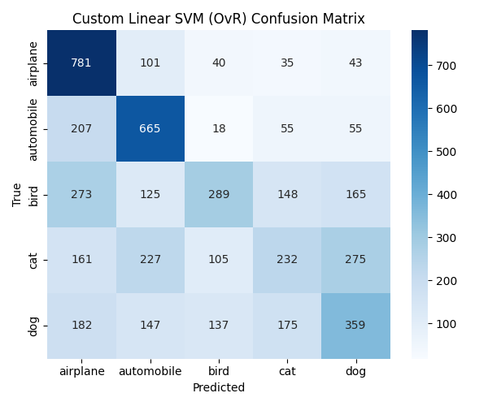
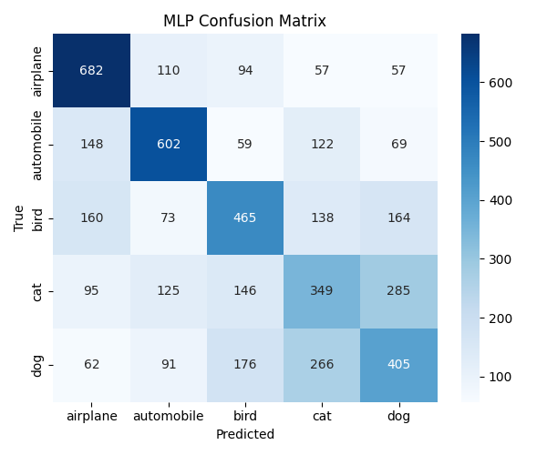
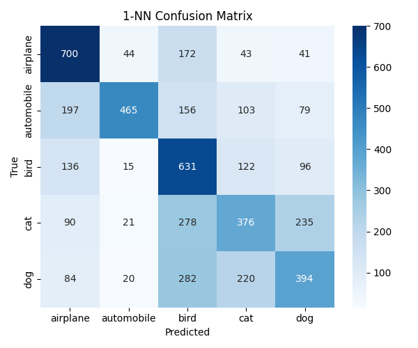
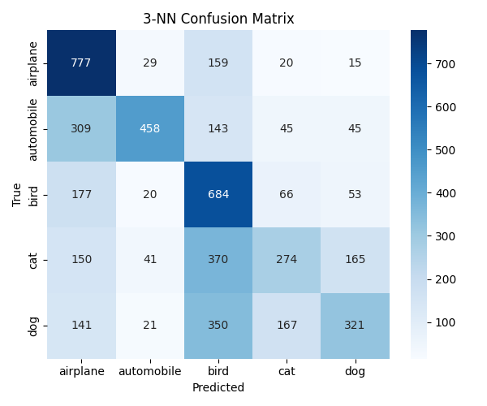
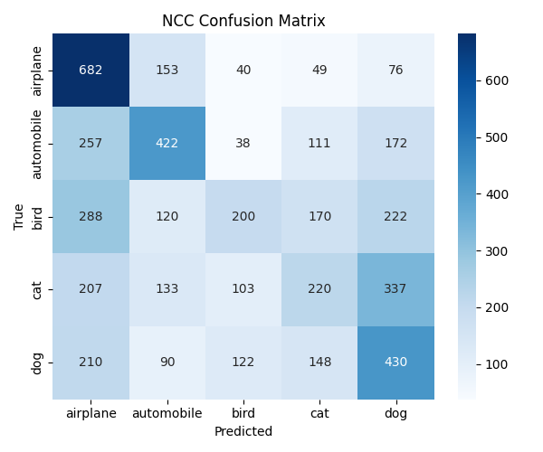
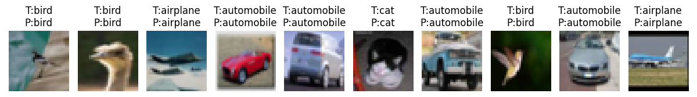
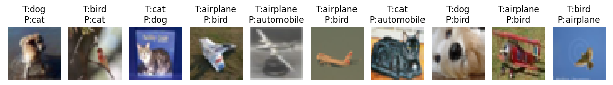

# SVMs vs. Baseline Classifiers on a CIFAR-10 Subset

A comparative study of **Support Vector Machines** with linear, polynomial and RBF kernels, against **k-Nearest Neighbors**, **Nearest Class Centroid**, a **from-scratch linear SVM** and a **from-scratch MLP with hinge loss**, on a 5-class subset of CIFAR-10.

> Project 2 of [Neural Networks & Deep Learning](../README.md), ECE AUTh (Fall 2025).

## Highlights

- **RBF-kernel SVM reaches 65.1% accuracy**, ahead of the linear kernel (53.5%), the polynomial kernel (56.4%) and every baseline
- **PCA** compresses each image from 3,072 to **91 features** and keeps 90% of the variance
- **Implemented from scratch in NumPy:**
  - a One-vs-Rest linear SVM trained with SGD on the hinge loss
  - a 1-hidden-layer MLP trained with the multi-class hinge loss (forward and backward pass written by hand)

## Setup

- **Data:** CIFAR-10, restricted to 5 classes (airplane, automobile, bird, cat, dog), with the standard train/test split
- **Preprocessing:** pixels scaled to [0, 1] → flattened to 3,072-dim vectors → PCA (90% variance, 91 components)
- All models are trained and evaluated on the same PCA features

| Model | Implementation | Details |
|---|---|---|
| kNN (k = 1, 3) | scikit-learn | Euclidean distance |
| Nearest Class Centroid | NumPy (custom) | One mean vector per class |
| Linear SVM (OvR) | NumPy (custom) | SGD on hinge loss, C = 1, lr = 1e-4, 3 epochs |
| Linear SVM | scikit-learn `LinearSVC` | C = 1 |
| Polynomial SVM | scikit-learn `SVC` | degree 3, C = 1 |
| RBF SVM | scikit-learn `SVC` | C = 1, gamma = `scale` |
| MLP (hinge loss) | NumPy (custom) | 128 ReLU hidden units, mini-batch SGD, lr = 1e-3, batch size 128, 10 epochs |

## Results

| Model | Accuracy | Train time (s) | Test time (s) |
|---|---:|---:|---:|
| **RBF SVM** | **65.14%** | 20.49 | 6.48 |
| Polynomial SVM | 56.36% | 26.43 | 2.41 |
| Linear SVM (sklearn) | 53.50% | 1.49 | 0.002 |
| 1-NN | 51.32% | 0.002 | 1.51 |
| MLP, hinge loss (custom) | 51.08% | — | — |
| 3-NN | 50.28% | 0.001 | 0.14 |
| Linear SVM (custom) | 46.52% | — | — |
| Nearest Class Centroid | 39.08% | 0.000 | 0.005 |

The non-linear RBF kernel clearly beats linear decision boundaries. The cost is training time, which is about 14× that of the linear SVM.

### Confusion matrix: RBF SVM

<p align="center"></p>

The vehicle classes are separated well. Most errors come from **cat ↔ dog** and from bird being confused with the other animals.

<details>
<summary>Confusion matrices for all other models</summary>

| | |
|---|---|
| **Linear SVM (sklearn)** <br>  | **Polynomial SVM** <br>  |
| **Linear SVM (custom)** <br>  | **MLP, hinge loss (custom)** <br>  |
| **1-NN** <br>  | **3-NN** <br>  |
| **Nearest Class Centroid** <br>  | |

</details>

### Example predictions (RBF SVM)

**Correct**
<p align="center"></p>

**Wrong**
<p align="center"></p>

## How to run

```bash
pip install -r requirements.txt
cd src
python run_all_experiments.py
```

CIFAR-10 is downloaded automatically into `./data` on first run. The script:
- runs every model and prints a results table
- shows each confusion matrix and saves it to `results/`
- shows the RBF SVM's correct and wrong predictions and saves them to `results/`

## Repository structure

```
├── src/
│   ├── run_all_experiments.py   # entry point: runs every model
│   ├── data_loader.py           # CIFAR-10 5-class subset
│   ├── features.py              # PCA
│   ├── knn_ncc.py               # kNN (sklearn + custom) and Nearest Class Centroid
│   ├── svm_custom.py            # linear SVM + One-vs-Rest, from scratch
│   ├── svm_sklearn.py           # linear / polynomial / RBF SVMs
│   ├── mlp_numpy.py             # MLP with hinge loss, from scratch
│   └── visualization.py         # confusion matrices, example grids
├── requirements.txt
├── assets/                      # figures used in this README
└── docs/report.pdf              # full project report
```

## Report

The full write-up (methodology, results, discussion) is in [`docs/report.pdf`](docs/report.pdf).
