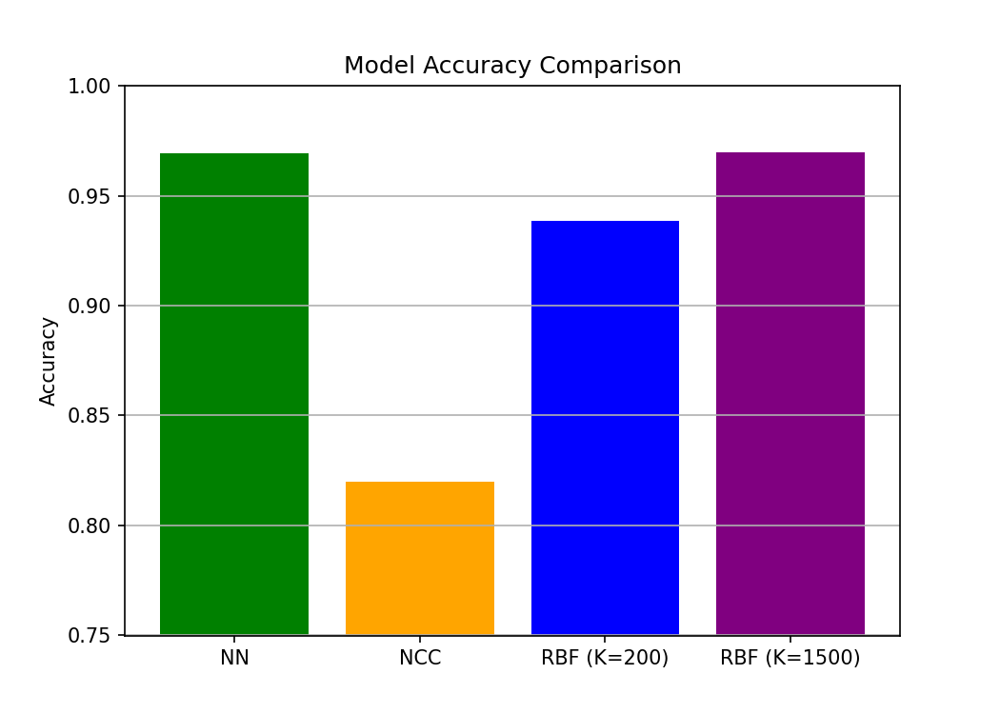
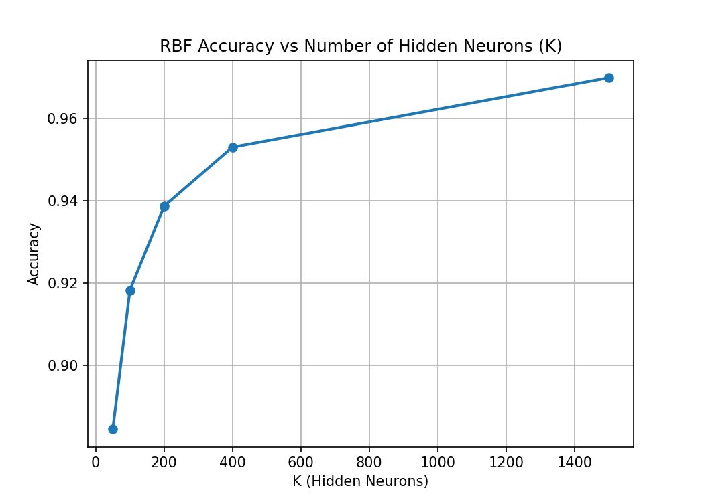
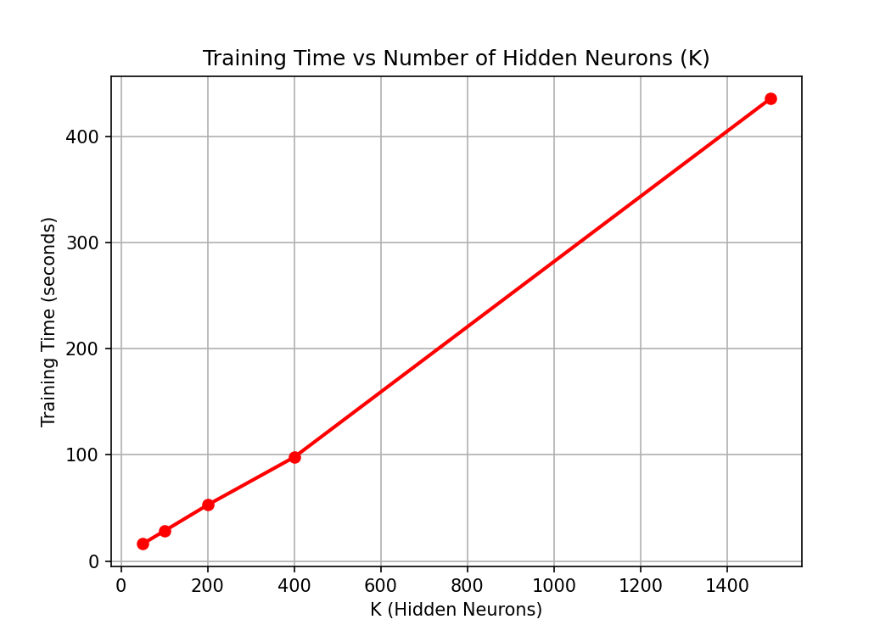
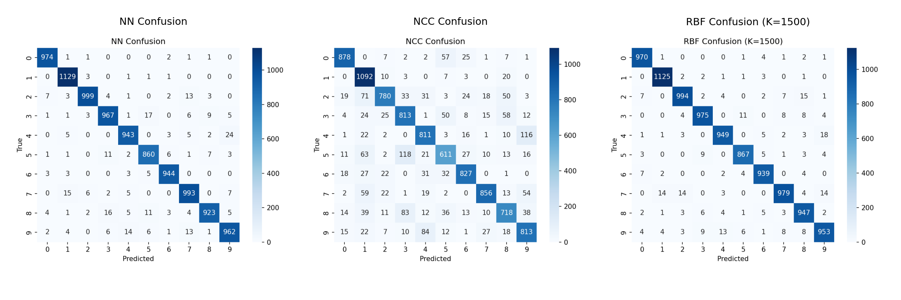
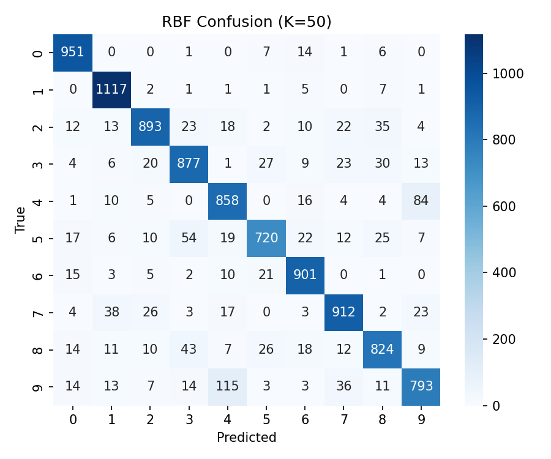
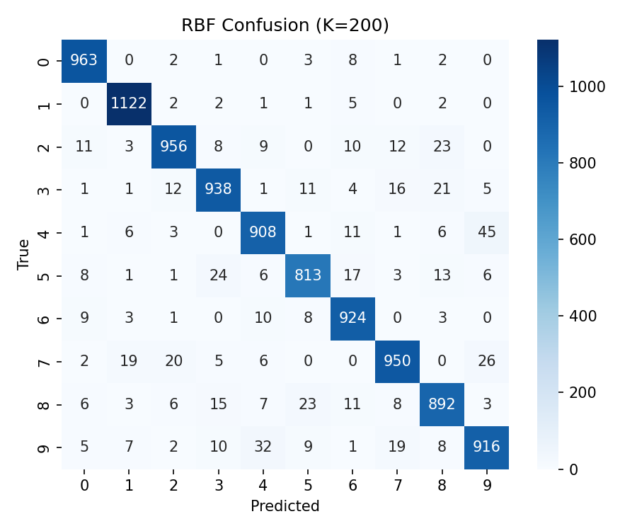
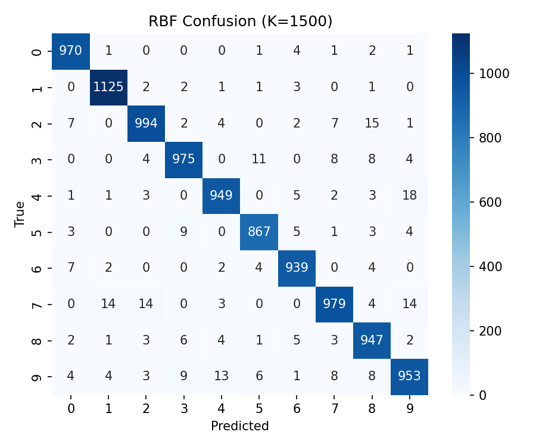
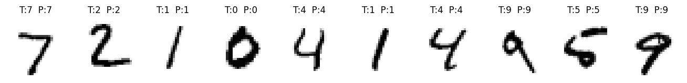
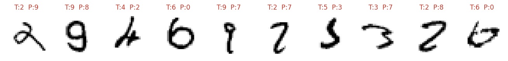

# RBF Neural Network for MNIST Digit Classification

A **Radial Basis Function (RBF) network**, implemented from scratch in NumPy, for handwritten digit classification on **MNIST**. The project studies how the number of hidden neurons and the PCA dimensionality affect accuracy and training cost, and compares the network against **Nearest Neighbor** and **Nearest Class Centroid** baselines.

> Project 3 of [Neural Networks & Deep Learning](../README.md), ECE AUTh (Fall 2025).

## Highlights

- **96.98% test accuracy** with K = 1500 Gaussian hidden units. This matches the 1-NN baseline (96.94%), but inference only needs distances to 1,500 centers instead of all 60,000 training samples.
- **RBF network written by hand:**
  - k-means or random center selection
  - Gaussian activations with a global or per-center width σ
  - output layer solved in closed form with **ridge regression**
- **PCA** reduces each image from 784 to 154 features (95% variance) with no loss in accuracy

## Method

```
Input (784 px) → PCA (154 comps) → K Gaussian units φ_k(z) = exp(−‖z − c_k‖² / 2σ²) → Linear layer (+bias) → argmax over 10 classes
```

| Component | Options (see `train_rbf.py` flags) | Default |
|---|---|---|
| Centers `c_k` | k-means clustering, random training samples | k-means |
| Width σ | global (median distance between centers), per-center (mean distance to 10 nearest samples) | global median |
| Output weights | ridge regression, `W = (ΦᵀΦ + λI)⁻¹ ΦᵀY` | λ = 1e-3 |
| Hidden units K | any | 1500 |
| PCA variance | any | 95% |

**Baselines:** 1-Nearest Neighbor and Nearest Class Centroid (scikit-learn), both on the same PCA features.

## Results

### Comparison of models

| Model | Test accuracy | Training time |
|---|---:|---:|
| **RBF, K = 1500** | **96.98%** | 436 s |
| 1-Nearest Neighbor | 96.94% | 2.4 s |
| RBF, K = 400 | 95.30% | 98 s |
| RBF, K = 200 | 93.87% | 53 s |
| Nearest Class Centroid | 81.99% | 0.09 s |

<p align="center"></p>

### Effect of the number of hidden units K

| K | 50 | 100 | 200 | 400 | 1500 |
|---|---:|---:|---:|---:|---:|
| Accuracy | 88.46% | 91.83% | 93.87% | 95.30% | **96.98%** |
| Training time (s) | 16 | 28 | 53 | 98 | 436 |

<p align="center">
  
  
</p>

Accuracy rises steadily with K, with diminishing returns. Training time grows with K, mostly from k-means clustering and building the design matrix.

### Effect of PCA variance (K = 200)

| Variance retained | 90% | 95% | 99% |
|---|---:|---:|---:|
| Accuracy | 94.00% | 93.87% | 93.87% |

Keeping more principal components does not help. The discriminative structure of MNIST fits in a much smaller subspace.

### Confusion matrices

<p align="center"></p>

The remaining errors are mostly visually similar digits: **4 ↔ 9**, **7 → 1 / 2 / 9**, **2 → 8** and **3 ↔ 5**.

<details>
<summary>RBF confusion matrices for every K</summary>

| | |
|---|---|
| **K = 50** <br>  | **K = 100** <br>  |
| **K = 200** <br>  | **K = 400** <br>  |
| **K = 1500** <br>  | |

</details>

### Example predictions (RBF, K = 1500)

**Correct**
<p align="center"></p>

**Wrong** (T = true label, P = prediction)
<p align="center"></p>

## How to run

```bash
pip install -r requirements.txt
cd src
python train_rbf.py                                  # default: K=1500, k-means centers, median σ, 95% PCA
python train_rbf.py --K 200 --pca-variance 0.90      # smaller, faster model
python train_rbf.py --centers-mode random --sigma-mode per_center --ridge 0.01
```

MNIST is downloaded automatically into `./data` on first run. The script:
- prints the accuracy of the RBF network and both baselines
- saves the confusion matrices and example predictions to `results/`

`make_plots.py` recreates the summary plots in `assets/` from the recorded results.

## Repository structure

```
├── src/
│   ├── train_rbf.py       # entry point: PCA, baselines, RBF training & evaluation
│   ├── rbf.py             # RBF network: centers, σ estimation, design matrix, ridge solution
│   ├── data.py            # MNIST loading + PCA
│   ├── baselines.py       # Nearest Neighbor, Nearest Class Centroid
│   ├── visualization.py   # confusion matrices, example predictions
│   └── make_plots.py      # summary plots
├── requirements.txt
├── assets/                # figures used in this README
└── docs/report.pdf        # full project report
```

## Report

The full write-up (methodology, experiments, discussion) is in [`docs/report.pdf`](docs/report.pdf).
